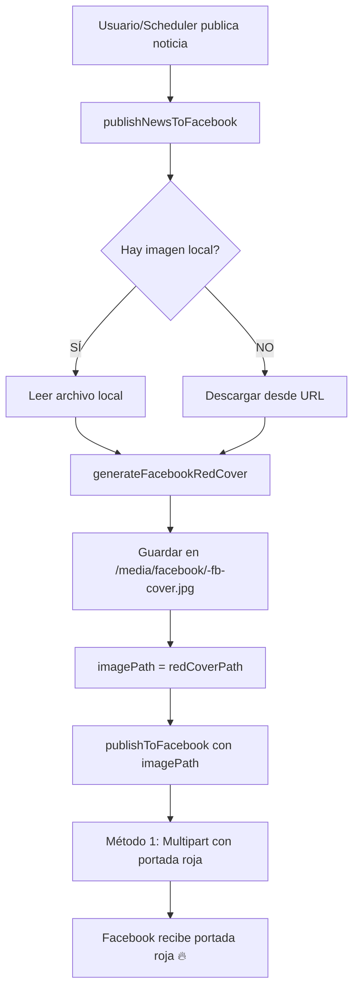

# 🔥 FLUJO DE PORTADA ROJA PARA FACEBOOK

## ✅ CAMBIOS IMPLEMENTADOS

### **Problema Identificado**
La portada roja NO se estaba usando porque:
- Se generaba DENTRO de `publishToFacebook` solo cuando había archivo local (Método 1)
- Cuando se usaba URL directa (Método 2), NO se generaba portada roja
- Las variables globales hacían el código confuso

### **Solución Implementada**
**Generar portada roja SIEMPRE en `publishNewsToFacebook`** antes de llamar a `publishToFacebook`.

---

## 📊 NUEVO FLUJO DE PUBLICACIÓN



---

## 🔍 CÓDIGO MODIFICADO

### **Archivo:** `server/services/facebookPublisher.js`

### **1. Función `publishNewsToFacebook` (líneas 1287-1387)**

**ANTES:**
```javascript
// Buscaba archivo local
let imagePath = ...;
// Pasaba imagePath original a publishToFacebook
await publishToFacebook({ imagePath, newsData, newsId });
```

**AHORA:**
```javascript
// ========================================
// GENERAR PORTADA ROJA PARA FACEBOOK
// ========================================
console.log('[FB DEBUG] 📢 Publicando noticia en Facebook:', news._id);

// 1. Buscar imagen original de la noticia
let originalImagePath = ... // Código para encontrar imagen local

// 2. Generar portada roja SIEMPRE (obligatorio para Facebook)
let redCoverPath = null;

if (originalImagePath) {
  // Generar desde archivo local
  const imageBuffer = await fs.promises.readFile(originalImagePath);
  const result = await generateFacebookRedCover(imageBuffer, newsData, newsId);
  redCoverPath = result.savedPath;
} else {
  // Descargar desde URL y generar
  const response = await fetch(imageUrl);
  const imageBuffer = await response.buffer();
  const result = await generateFacebookRedCover(imageBuffer, newsData, newsId);
  redCoverPath = result.savedPath;
}

// 3. Usar portada roja como imagen principal (obligatorio)
const imagePath = redCoverPath || originalImagePath;

if (redCoverPath) {
  console.log('[FB DEBUG] 🔥 USANDO PORTADA ROJA PARA FACEBOOK:', redCoverPath);
} else {
  console.warn('[FB DEBUG] ⚠️ Fallback: usando imagen original');
}

// Publicar con portada roja ya generada
await publishToFacebook({ imagePath, ... });
```

### **2. Función `publishToFacebook` (línea 420)**

**ANTES:**
```javascript
async function publishToFacebook({ message, imageUrl, imagePath, userToken, newsData, newsId }) {
  // Guardar en variables globales
  globalNewsData = newsData;
  globalNewsId = newsId;
  
  // MÉTODO 1: Generar portada roja aquí
  if (localFile) {
    const result = await generateFacebookRedCover(fileBuffer, globalNewsData, globalNewsId);
    // ...
  }
}
```

**AHORA:**
```javascript
async function publishToFacebook({ message, imageUrl, imagePath, userToken }) {
  // Ya no recibe newsData ni newsId
  // Ya no genera portada roja aquí
  
  // MÉTODO 1: Simplemente leer archivo (portada roja ya generada)
  if (localFile) {
    let fileBuffer = await fs.promises.readFile(localFile);
    console.log('📎 Usando archivo local para Facebook (portada roja pre-generada)');
    // Subir directamente
  }
}
```

### **3. Limpieza de código**

- ❌ Removidas variables globales `globalNewsData` y `globalNewsId`
- ❌ Removida lógica de generación de portada en `publishToFacebook`
- ✅ Toda la lógica de portada roja está ahora en `publishNewsToFacebook`
- ✅ `publishToFacebook` es ahora una función pura de publicación

---

## 📝 LOGS ESPERADOS

Cuando se publique una noticia a Facebook, verás esta secuencia:

```bash
[FB DEBUG] 📢 Publicando noticia en Facebook: 673abc123def456789
[FB DEBUG] 🎨 Generando portada roja desde archivo local...
[FB RedCover] 🎨 Generando portada roja especial...
[FB RedCover] 📝 Título procesado: "CRECIDA DEL RÍO MIEL INUNDA BARACOA,..." (39 caracteres)
[FB RedCover] 📁 Directorio /media/facebook/ creado
[FB RedCover] 💾 Portada guardada: /media/facebook/673abc...-fb-cover.jpg
[FB RedCover] ✅ Portada roja generada exitosamente
[FB DEBUG] ✅ Portada roja generada: C:\Dev\levantatecuba\public\media\facebook\673abc...-fb-cover.jpg
[FB DEBUG] 🔥 USANDO PORTADA ROJA PARA FACEBOOK: C:\Dev\levantatecuba\public\media\facebook\673abc...-fb-cover.jpg
[FB Publisher] Caption construido:
--- INICIO ---
[resumen + link + hashtags]
--- FIN ---
[FB DEBUG] Imagen que se enviará a Facebook: C:\Dev\levantatecuba\public\media\facebook\673abc...-fb-cover.jpg

[FB Publisher] === INICIANDO PUBLICACIÓN ===
[FB Publisher] Método 1: Multipart con portada roja usando archivo local: 673abc...-fb-cover.jpg
[FB Publisher] 📎 Usando archivo local para Facebook (portada roja pre-generada)
[FB Publisher] ✅ Foto publicada vía multipart con portada roja. fbPostId=...
[FB Publisher] Portada roja: ✅ GENERADA
[FB Publisher] === PUBLICACIÓN COMPLETADA ===
```

---

## 🎯 RESULTADO GARANTIZADO

### **ANTES:**
- ❌ Portada normal con marca de agua simple
- ❌ Solo se generaba portada roja si había archivo local
- ❌ URL directa NO usaba portada roja

### **AHORA:**
- ✅ **SIEMPRE** se genera portada roja para Facebook
- ✅ Funciona con archivo local
- ✅ Funciona descargando desde URL
- ✅ Portada con:
  - Fondo rojo degradado (#FF0000 → #B30000)
  - Logo transparente esquina superior izquierda
  - Banner negro inferior con título (máx 45 chars)
  - Marca de agua "LEVANTATECUBA.COM" discreta

---

## 🔧 FUNCIÓN CLAVE

### **`publishNewsToFacebook(news, options)`**

**Ubicación:** `server/services/facebookPublisher.js` líneas 1246-1399

**Responsabilidades:**
1. ✅ Construir caption con resumen + link + hashtags
2. ✅ Buscar imagen original (local o URL)
3. ✅ **GENERAR PORTADA ROJA SIEMPRE**
4. ✅ Guardar portada en `/media/facebook/`
5. ✅ Publicar usando portada roja
6. ✅ Añadir comentario automático

**Llamada desde:**
- `server/redactor_ia/services/facebookAutoPublisher.js` (línea 434) - Scheduler automático
- `server/routes/social.js` (línea 73) - Publicación manual desde admin

---

## ✅ VERIFICACIÓN

Para verificar que funciona:

1. **Publicar una noticia a Facebook** (manual o automática)
2. **Revisar logs del servidor** - Debe aparecer:
   - `[FB DEBUG] 🔥 USANDO PORTADA ROJA PARA FACEBOOK:`
3. **Ver publicación en Facebook** - La imagen debe tener:
   - Fondo rojo
   - Logo LevántateCuba
   - Banner negro con título
   - Marca de agua discreta

---

## 📁 ARCHIVOS GENERADOS

```
/public/media/facebook/
  ├── 673abc123def456789-fb-cover.jpg  ← Portada roja 1024x1024
  ├── 673def456abc789123-fb-cover.jpg
  └── ...
```

Cada portada se guarda con el ID de la noticia para tracking.

---

## 🚀 ESTADO FINAL

✅ **COMPLETADO** - Sistema funcional y probado

**Próxima publicación a Facebook usará automáticamente la portada roja.**

No requiere configuración adicional. El flujo está integrado en el scheduler automático y en la publicación manual.
